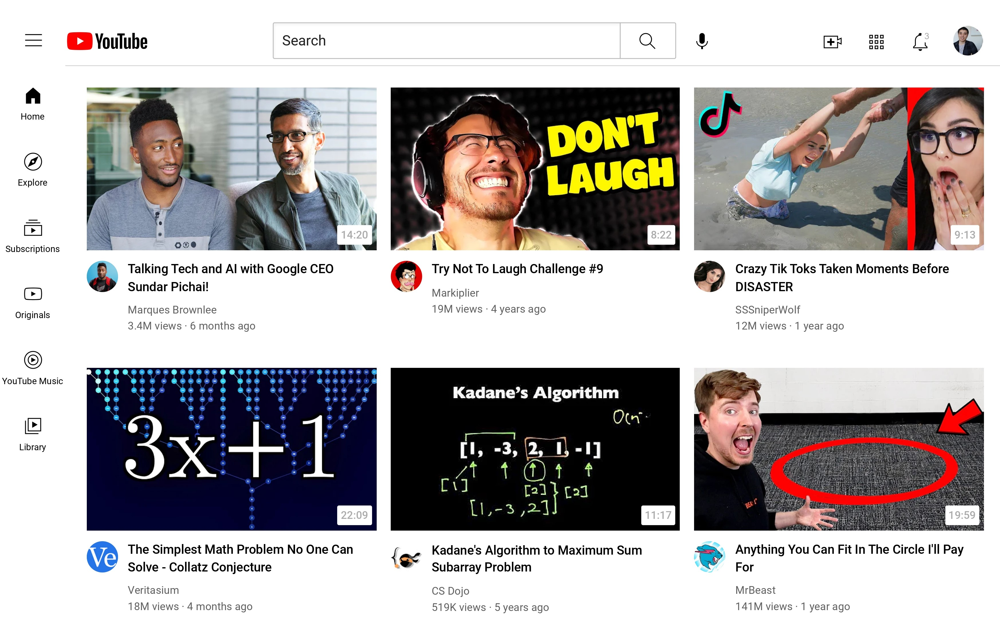

# YOUTUBE-CLONE
### INTRODUCTION:

This is a clone of Youtube.com.
It reflects my Front-end skills implemented on this project.  
This replica has been produced as an exercise to enhance my HTML, CSS skills. 
Please have a look at the final piece attached below compared to the original piece refrenced in the last section. 

  

### CITATIONS:

https://www.youtube.com/watch?v=G3e-cpL7ofc&t=10s&ab_channel=SuperSimpleDev

